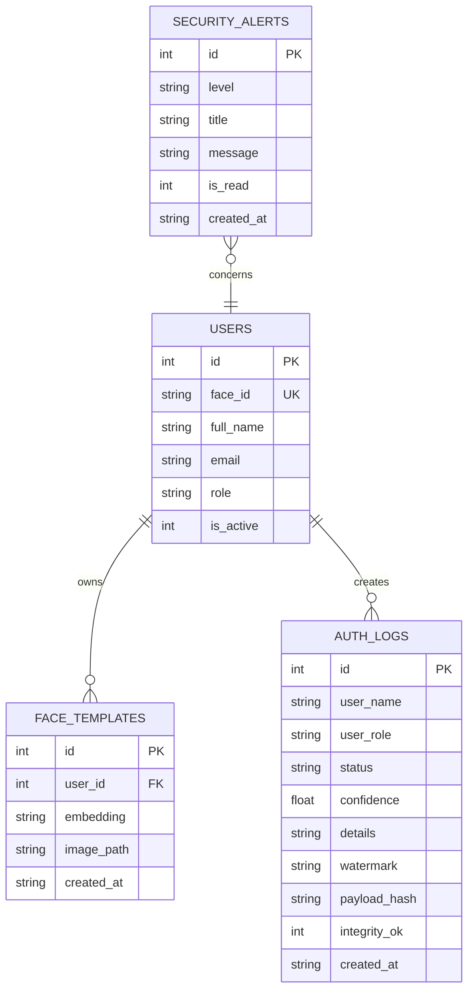

# Database Schema

```mermaid
erDiagram
    USERS ||--o{ FACE_TEMPLATES : "owns"
    USERS ||--o{ AUTH_LOGS : "creates"
    SECURITY_ALERTS }o--|| USERS : "concerns"

    USERS {
        int id PK
        string face_id UK
        string full_name
        string email
        string role
        int is_active
    }

    FACE_TEMPLATES {
        int id PK
        int user_id FK
        string embedding
        string image_path
        string created_at
    }

    AUTH_LOGS {
        int id PK
        string user_name
        string user_role
        string status
        float confidence
        string details
        string watermark
        string payload_hash
        int integrity_ok
        string created_at
    }

    SECURITY_ALERTS {
        int id PK
        string level
        string title
        string message
        int is_read
        string created_at
    }
```
